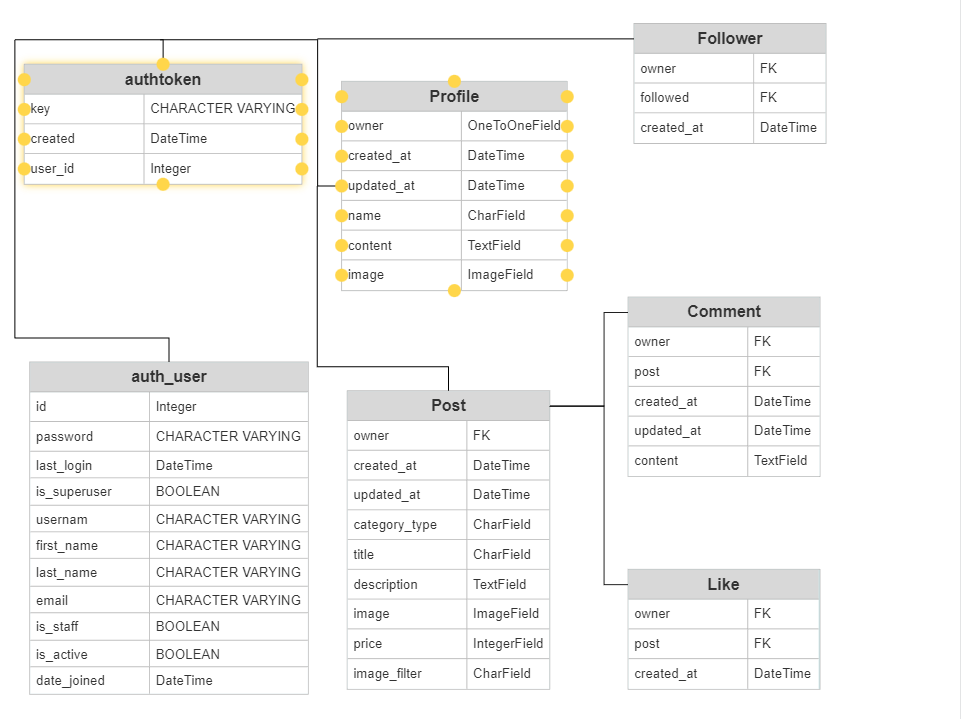
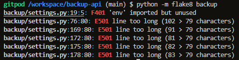
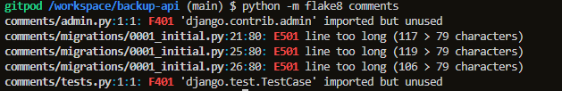
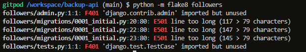
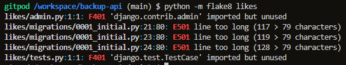
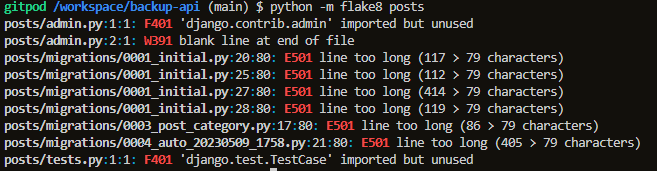
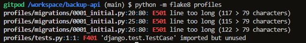

# Marketplace API

Marketplace API is the backend database used by the [Marketplace application](https://github.com/Undie92/Marketplace)

___

## Content

* [Development Goals](#development-goals)
* [CRUD Functionality](#crud-functionality)
* [Database Design](#database-design)
* [API End Points](#api-end-points)
* [Technology Used](#technology-used)
* [Packages](#packages)
* [Testing](#testing)
* [Deployment](#deployment)
    * [Deploying to Heroku](#heroku)
    * [Forking the GitHub Repository](#forking-the-github-repository)
    * [Creating a Local Clone](#creating-a-local-clone)

___
## Development Goals

The goal of this application was to host the database for the frontend application "Marketplace". The design of the database is to allow full CRUD functionality across the platform via the user interface.

[Back To Top](#marketplace-api)
___

## CRUD Functionality

Full CRUD functionalite has been used in this project.

* Create - Users can create profiles, posts, comments. Users can like posts. Users can follow other users.
* Read - User can view all posts with products, all followed profiles, all liked posts and comments.
* Update - Users can update posts, comments. Follow & Unfollow. Like & Unlike.
* Delete - Users can delete Posts, comments.

[Back To Top](#marketplace-api)
___

## Database Design

Database diagram that shows the relationship between the apps that has been created during this project.

[Back To Top](#marketplace-api)

___

## API End Points

### Posts

End Point: /posts/

* POST - To create a post
* GET - To list all posts

End point: /posts/int:pk/

* PUT - To update a single post
* GET - To get a single post
* DELETE - To delete a post

### Comments

End Point: /comments/

* POST - To create a comment
* GET - To list all comments

End Point: /comments/int:pk/

* PUT - To update a single comment
* GET - To get a single comment
* DELETE - To delete a comment

### Likes

End Point: /likes/

* POST - To like a post
* GET - To list all likes

End Point: /likes/int:pk/

* PUT - To update a single like
* GET - To get a single like
* DELETE - To delete a like

### Followers

End Point: /followers/

* POST - To follow a profile
* GET - To list all followers

End Point: /followers/int:pk/

* PUT - To update a follow
* GET - To get a single follow
* DELETE - To delete a follow

### Profiles

End Point: /profiles/

* POST - To update a rofile
* GET - To list all profiles

End Point: /profiles/int:pk/

* PUT - To update a profile
* GET - To get a single profile
* DELETE - To delete a profile

[Back To Top](#marketplace-api)
___

## Technology Used

* Django
    * Main framework used for application creation

* Django REST Framework
    * Framework used for creating API

* Cloudinary
    * Used for static image hosting

* Heroku
    * Used to host the application

* ElephantSql
    * Used to host the database

* Git 
    * Used for version control

* GitHub
    * Repository for storing code

[Back To Top](#marketplace-api)
___

## Packages

* asgiref==3.6.0
* cloudinary==1.32.0
* dj-database-url==0.5.0
* dj-rest-auth==2.1.9
* Django==3.2.18
* django-allauth==0.44.0
* django-cloudinary-storage==0.3.0
* django-cors-headers==3.14.0
* django-filter==23.2
* djangorestframework==3.14.0
* djangorestframework-simplejwt==4.7.2
* gunicorn==20.1.0
* oauthlib==3.2.2
* Pillow==8.2.0
* psycopg2==2.9.6
* PyJWT==2.6.0
* python3-openid==3.2.0
* pytz==2023.3
* requests-oauthlib==1.3.1
* sqlparse==0.4.4

[Back To Top](#marketplace-api)
___

## Testing

All folders were run through flake8. Several issues appeared with various reasons, lines too long, blank spaces, no new line.

All issues were resolved with the exception of lines too long in migration files (these are auto generated so I did not fix) and the auth validator lines in the settings.py which seem to be unbreakable but are framework code.

A warning appeared for env.py being imported but unused although this is being used in the development version, so this was ignored.

Backup

Comments

Followers

Likes

Posts

Profiles

[Back To Top](#marketplace-api)
___

## Deployment

### Heroku

The site was deployed to Heroku. The steps to deploy are as follows:

* Navigate to heroku and create an account
* Click the new button in the top right corner
* Select create new app
* Enter app name
* Select region and click create app
* Click the resources tab and search for Heroku Postgres
* Select hobby dev and continue
* Go to the settings tab and then click reveal config vars
* Add the following config vars:
    * SECRET_KEY: (Your secret key)
    * DATABASE_URL: (From your ElephantSql)
    * ALLOWED_HOST: url for you backend deployed
    * CLIENT_ORIGIN: url for the client front end react application that will be making requests to these APIs
    * CLIENT_ORIGIN_DEV: address of the local server used to preview and test UI during development of the front end client application
    * CLOUDINARY: (Your cloudinary link)
    * DISABLE_COLLECTSTATIC: 1
* Click the deploy tab
* Scroll down to Connect to GitHub and sign in / authorize when prompted
* In the search box, find the repositoy you want to deploy and click connect
* Scroll down to Manual deploy and choose the main branch
* Click deploy

___

### Forking the GitHub Repository

Steps to Fork the GitHub Repository

Forking allows you to view and edit the code without affecting the original repository

1. Locate the GitHub repository. Link to this repository can be found [here](https://github.com/Undie92/backup-api).
2. Click on 'Fork', in the top right-hand corner.
3. This will take you to your own repository to a fork with the same name as the original branch.

___

### Creating a Local Clone

Steps to Creating a Local Clone

1. Go to the GitHub repository. Link to this repository can be found [here](https://github.com/Undie92/backup-api).
2. Click on 'Code' to the right of the screen. This will open a dropdown. Click on HTTPs and copy the link.
3. Open Git Bash in your IDE and change the current working directory to the location where you want the cloned directory.
4. Type `git clone`, paste the URL you copied earlier, and press Enter to create your local clone.

More information on Creating and Managing repositories can be found [here](https://docs.github.com/en/repositories/creating-and-managing-repositories/cloning-a-repository)
 

[Back To Top](#marketplace-api)

___